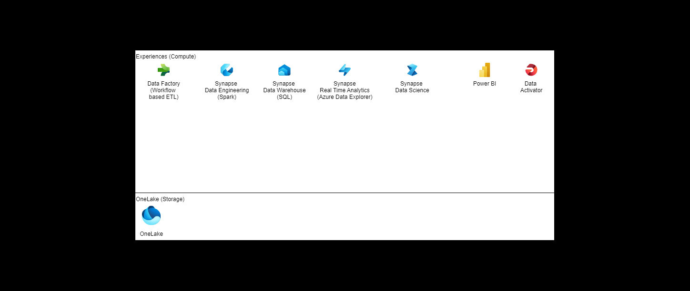

# Useful Architectures

If you see this on github.com, please visit https://jugi92.github.io/useful_architectures/ for better visibility of the graphs.

This is a collection of useful architecture drawings, which solve one or multiple potential usecases, including comments or alternatives.
## Analytics
- Synapse Analytics
  Full view with Layers: 
  [Analytics-with-Azure Synapse](analytics-with-azuresynapse.drawio.html)

  
- Fabric
  Full view with Layers
  [Fabric](Fabric.html)

  Fabric Assets animated
  

  Fabric Assets
  

  Fabric Hierarchy  
  

  Fabric Governance Types  
  

## AI
### RAG Pattern

If you have an additional one or more insights on the existing ones, feel free to submit a Pull Request.